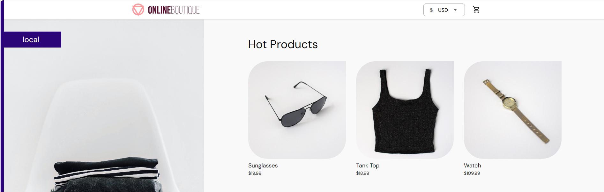
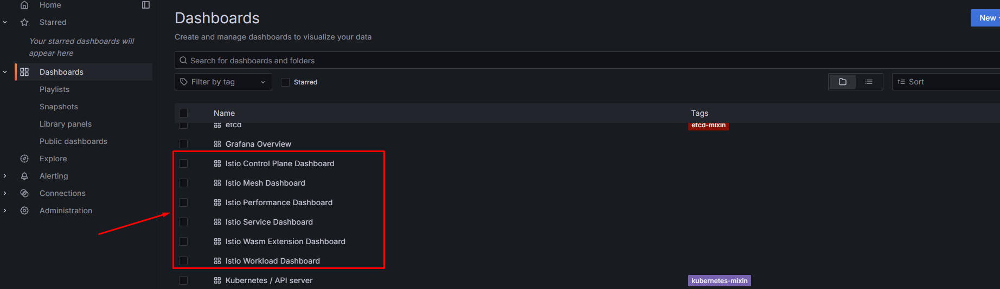
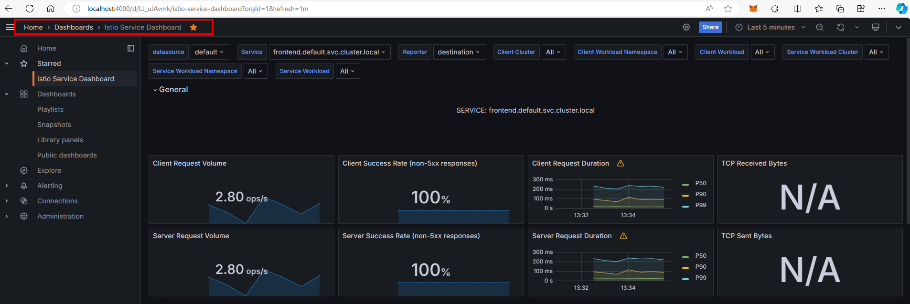
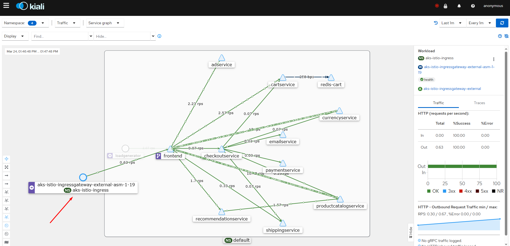
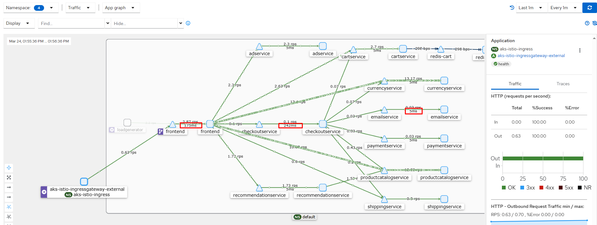

# Project: Deploy and monitor k8s application on AKS with Istio service mesh

## Overview

### Introduction

This project help us practice Istio service mesh on AKS

- Tech stack: `Azure`, `AKS`, `Terraform`, `k8s`, `helm`, `istio`, `Prometheus/Grafana`
- To get basic concept of these tools, you could visit: [**devops-basic**](https://github.com/tungbq/devops-basic) repository

### Prerequisite

- Tools: `helm>3.10`, `kubectl`, `azcli`

## 1-Provision a fresh AKS cluster

Provision AKS cluster, follow section 1 `1-Provision a fresh AKS cluster` in this project: [terraform-aks-cluster](https://github.com/tungbq/devops-project/tree/main/projects/terraform-aks-cluster#1-provision-a-fresh-aks-cluster), with some notes:

- Update the VM type of `vm_size` in values.tf to `Standard_D3_v2` (more powerful compute)

```terraform
variable "vm_size" {
  type        = string
  description = "The VM size for the node pool."
  default     = "Standard_D3_v2"
}
```

- Only run the code in section 1 (`1-Provision a fresh AKS cluster`), skip the rest

## 2-Prepare Environment

- Declare the absolute DevOps project path to use later in `kubectl` command
- When we open new terminal, we should run these commands to set environment again

```bash
# Change to yours
export CLUSTER="cluster-golden-sturgeon"
# Change to yours
export RESOURCE_GROUP="rg-genuine-longhorn"
export DEVOPS_PROJECT_PATH="/mnt/d/CODING/GITHUB/OPEN-SOURCE/my-project/devops-project" # replace by yours
export KUBECONFIG=$DEVOPS_PROJECT_PATH/projects/terraform-aks-cluster/private_k8s_config/azurek8s
kubectl get nodes
```

## 3-Enable ASM add on on AKS

Once we have cluster available from step 1, get the `CLUSTER` and `RESOURCE_GROUP` from console to use in later steps:

```bash
# Enable
az aks mesh enable --resource-group ${RESOURCE_GROUP} --name ${CLUSTER}
# Verify
az aks show --resource-group ${RESOURCE_GROUP} --name ${CLUSTER}  --query 'serviceMeshProfile.mode'
# Check pods for istio
kubectl get pods -n aks-istio-system

# Enable side car injection for a namespace, if we deploy in another namespace, add more
## Get current version
az aks show --resource-group ${RESOURCE_GROUP} --name ${CLUSTER} | grep asm
## Set base on version
kubectl label namespace default istio.io/rev=asm-1-20 --overwrite
kubectl label namespace aks-istio-system istio.io/rev=asm-1-20 --overwrite
## apply for more labels as your needed...
```

**NOTE:**

- It will take few minutes (~ 4m) to enable istio adon to your cluster
- The istio will be installed in `aks-istio-system` namespace

## 4-Deploy microservices sample app

- Deploy sample app
  From: https://github.com/GoogleCloudPlatform/microservices-demo/blob/main/release/kubernetes-manifests.yaml

```bash
# Deploy shopping app
kubectl apply -f $DEVOPS_PROJECT_PATH/projects/aks-istio-application/k8s_manifests/shopping.yaml
# Check pod (should have at least 2 containers in a pod (including the Envoy side car))
## Will not work when specifying `-n aks-istio-system`
kubectl get pod
# Check services
kubectl get svc
```

## 5-Istio AKS External Gateway Config

### 5.1-Enable Istio AKS Gateway

- Doc: https://learn.microsoft.com/en-us/azure/aks/istio-deploy-ingress

```bash
# Enable Ingress Gateway
az aks mesh enable-ingress-gateway --resource-group $RESOURCE_GROUP --name $CLUSTER --ingress-gateway-type external
# Check
kubectl get svc aks-istio-ingressgateway-external -n aks-istio-ingress
```

**NOTE:**

- It will take few minutes to Enable Ingress Gateway to your cluster
- The istio will be installed in `aks-istio-system` namespace

### 5.2-Configure Istio AKS Gateway

- Applications aren't accessible from outside the cluster by default after enabling the ingress gateway. To make an application accessible, map the sample deployment's ingress to the Istio ingress gateway using the following manifest:

- Configure via YAML

```bash
kubectl apply -f $DEVOPS_PROJECT_PATH/projects/aks-istio-application/k8s_manifests/shopping-istio-gateway.yaml
## [expected-output]
# gateway.networking.istio.io/store-aio-gateway-external created
# virtualservice.networking.istio.io/store-aio-vs-external created
```

### 5.3-Access Istio AKS Gateway

```bash
export INGRESS_HOST_EXTERNAL=$(kubectl -n aks-istio-ingress get service aks-istio-ingressgateway-external -o jsonpath='{.status.loadBalancer.ingress[0].ip}')
export INGRESS_PORT_EXTERNAL=$(kubectl -n aks-istio-ingress get service aks-istio-ingressgateway-external -o jsonpath='{.spec.ports[?(@.name=="http2")].port}')
export GATEWAY_URL_EXTERNAL=$INGRESS_HOST_EXTERNAL:$INGRESS_PORT_EXTERNAL
echo "http://$GATEWAY_URL_EXTERNAL/"
```

At this point we could visit the public application frontend page via Gateway URL: http://$GATEWAY_URL_EXTERNAL/, result looks like:


### 5.4-Test the frontend page (optional)

- Run this script to simulate the external access to the frontend page

```bash
$DEVOPS_PROJECT_PATH/projects/aks-istio-application/scripts/frontend_load_testing.sh $GATEWAY_URL_EXTERNAL
```

## 6-Deploy the Prometheus monitoring stack

### 6.1-Deploy aks-istio-system

- Using Helm and our customized prometheus configuration
- Deploy the prometheus stack (with istio metric configured)
- We should specify `--namespace aks-istio-system` to deploy the Prometheus in same namespace with Istio on AKS

```bash
# Helm prepare
kubectl create ns aks-istio-system
helm repo add prometheus-community https://prometheus-community.github.io/helm-charts
helm repo update
# Deploy
helm upgrade --install kube-prometheus-stack prometheus-community/kube-prometheus-stack -f $DEVOPS_PROJECT_PATH/projects/aks-istio-application/helm_manifests/istio_prom_values.yaml --namespace aks-istio-system
# Check deployment
kubectl get pod -n aks-istio-system
```

### 6.2-Access the dashboard

- Expose Grafana dashboard service (Open another terminal and set environment as step `2-Prepare Environment`)

```bash
# - Expose Grafana
kubectl port-forward svc/kube-prometheus-stack-grafana -n aks-istio-system 4000:80
```

- (Optional) Expose Prometheus service (Open another terminal and set environment as step `2-Prepare Environment`)

```bash
# Expose Prometheus (Optional)
kubectl port-forward svc/kube-prometheus-stack-prometheus -n aks-istio-system 4001:9090
```

Now we can login to http://localhost:4000 (The default username/password for Grafana is `admin/prom-operator`)

### 6.3-Add istio dashbord to grafana

- Run this script to add 6 Istio dashboards to Grafana automatically

```bash
$DEVOPS_PROJECT_PATH/projects/aks-istio-application/scripts/grafana-add-istio-dashboard.sh
```

### 6.4-Explore the Grafana dashboard

Access Grafana: http://localhost:4000/ to verify and expore the Istio dashboard

- Grafana Istio Dashboard list
  

- Grafana Istio Service Dashboard
  

## 7-Deploy Kiali

### 7.1-Prepare kiali manifest

- Doc: https://kiali.io/docs/installation/installation-guide/install-with-helm/
- Note: The default YAML manifests file related to kiali define namespace `istio-system`, but in AKS it is `aks-istio-system`
- So we need to adjust the `external_services` section of Kiali manifest to point to current internal Prometheus service link with this format: `<service-name>.<namespace>.svc.cluster.local:<service-port>`
- For example:

```yaml
external_services:
prometheus:
  url: http://kube-prometheus-stack-prometheus.aks-istio-system.svc.cluster.local:9090/
custom_dashboards:
  enabled: true
istio:
  root_namespace: aks-istio-system
```

### 7.2-Deploy Kiali

```bash
# Deploy
kubectl apply -f $DEVOPS_PROJECT_PATH/projects/aks-istio-application/k8s_manifests/kiali.yaml
# Verify
kubectl get svc -n aks-istio-system
```

### 7.3-Access the Kiali dashboard

- Expose Kiali dashboard service (Open another terminal and set environment as step `2-Prepare Environment`)

```bash
kubectl port-forward svc/kiali -n aks-istio-system 20001:20001
```

Now we can visit: http://localhost:20001 to explore the Kiali

### 7.4-Explore the Kiali UI

Now we can visualize our application/service graph with Kiali

- Kiali Service Graph
  

- Kiali App Graph with response time
  

## 8-Clean up resource

- Destroy the cluster, follow the `Delete AKS resources` of project [terraform-aks-cluster](../terraform-aks-cluster/)

## 9-Troubleshooting

For any issues, refer to [troubleshooting guide](./troubleshooting.md)

## 10-Related document

- aks: https://learn.microsoft.com/en-us/azure/aks/istio-deploy-ingress
- aks/istio: https://github.com/Azure-Samples/aks-store-demo/tree/main/manifests/istio
- kiali: https://github.com/kiali/kiali.io/commit/306fb8ac1d23928ad313c2511f04663c1e4f53b4
- kiali: https://github.com/kiali/kiali/issues/4703
- kiali: https://kiali.io/docs/installation/installation-guide/install-with-helm/
- kiali: https://kiali.io/docs/installation/installation-guide/
- prometheus: https://istio.io/latest/docs/ops/integrations/prometheus/#option-2-customized-scraping-configurations
- kiali token: https://kiali.io/docs/faq/authentication/
- kiali: https://kiali.io/docs/configuration/kialis.kiali.io/
- kiali-cr: https://kiali.io/docs/installation/installation-guide/creating-updating-kiali-cr/
