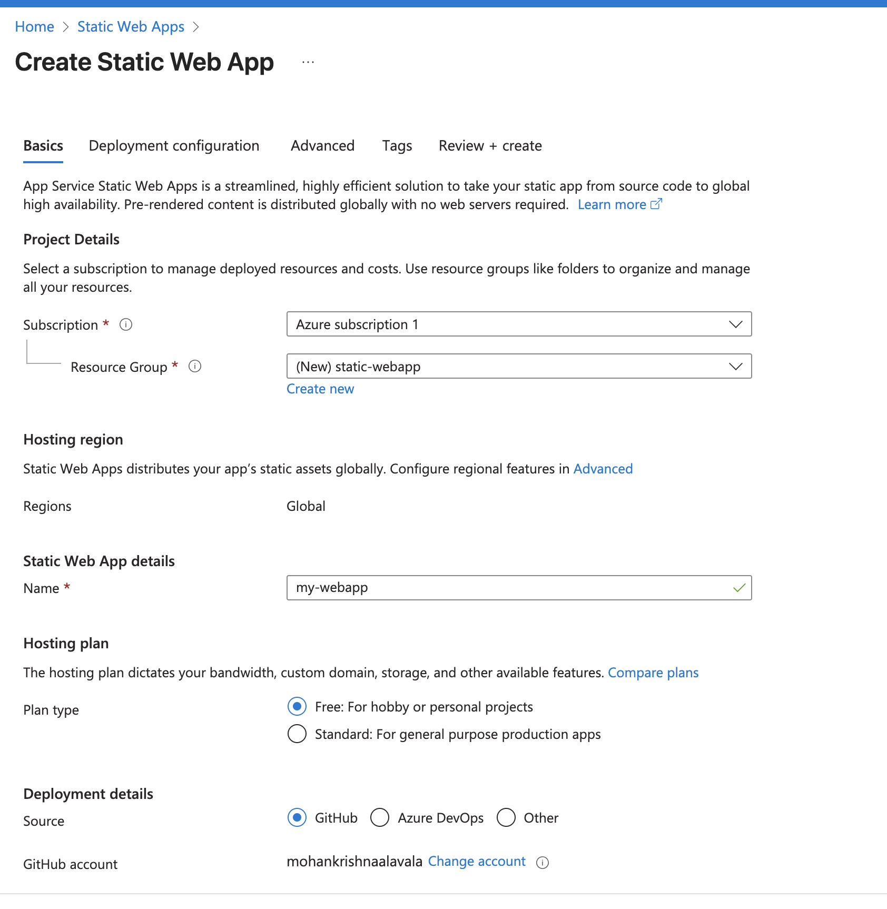
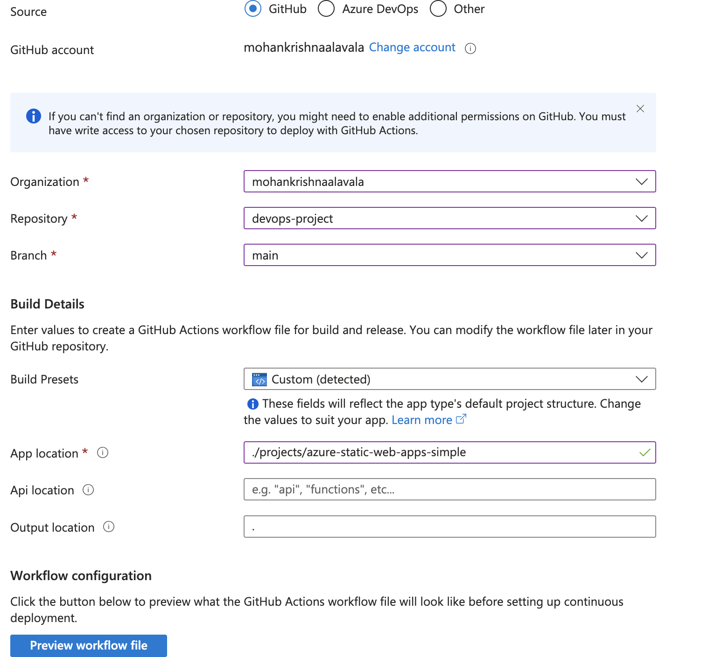

# Project — Azure Static Web Apps (Simple)

This mini-project shows how to host a static website on **Azure Static Web Apps (SWA)** and deploy it automatically from GitHub using **GitHub Actions**.

---

## What you’ll build
- A tiny static site (`index.html`, `styles.css`, `main.js`).
- A GitHub Actions workflow that deploys only when files in this project change.

---

## Prerequisites
- Azure subscription (Free tier is fine).
- Fork of this repository with this project folder present.

---

## Create the Static Web App (Portal)

When creating the SWA in the Azure Portal:

- **Build preset:** `HTML`
- **App location:** `projects/azure-static-web-apps-simple/src`
- **API location:** *(leave blank)*
- **Output location:** *(leave blank)*

- Static app creation Azure
  
  

If you connect GitHub in the portal creation wizard, Azure will generate a workflow in `.github/workflows/` for you. You can keep that, or use the generic workflow in this repo — just don’t keep **both** enabled at the same time.

---

## Local run
Open `src/index.html` directly in your browser, or use any static server:

cd projects/azure-static-web-apps-simple/src
python -m http.server 8000 

## Reference documents

- Azure: https://learn.microsoft.com/en-us/azure/static-web-apps/get-started-portal?tabs=vanilla-javascript&pivots=github