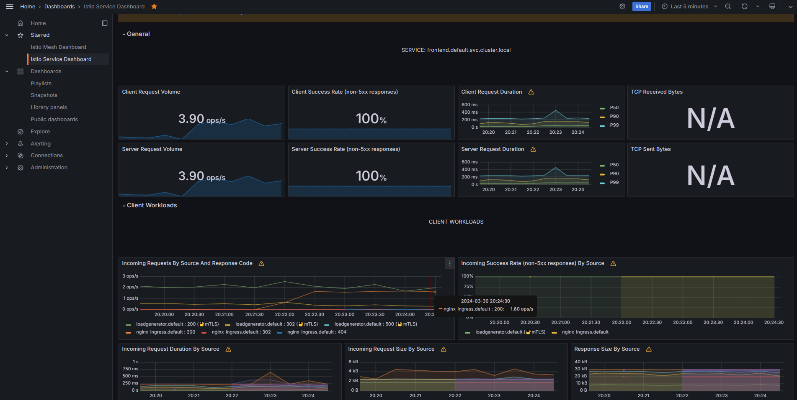

# Nginx Ingress with Istio service mesh

## Architecture

- Refer: https://docs.nginx.com/nginx-ingress-controller/tutorials/nginx-ingress-istio/
- Nginx Ingress is implemented as an entry point to an Istio service mesh

## Steps

### 0-Prepare environment

```bash
export DEVOPS_PROJECT_PATH="/mnt/d/CODING/GITHUB/OPEN-SOURCE/my-project/devops-project"
```

### 1-Deploy fresh cluster

- Check [terraform-aks-cluster](../terraform-aks-cluster/)

### 2-Enable istio

- Istio (aks-istio-system ns) and deploy app (default ns)
- Check [aks-istio-application](../aks-istio-application/) - Only step #1->#4 (skip step #5 and later)
- Enable side car enjection for nginx

```bash
kubectl create ns nginx-ingress
# Check current istio version on AKS
az aks show --resource-group ${RESOURCE_GROUP} --name ${CLUSTER} | grep asm
kubectl label namespace nginx-ingress istio.io/rev=asm-1-20 --overwrite

# Check labels
kubectl get namespaces -A --show-labels
```

### 3-Nginx deploy

- Deploy

```bash
kubectl apply -f $DEVOPS_PROJECT_PATH/projects/nginx-with-istio-on-aks/k8s_manifest/nginx_deployment.yaml
```

- Get the external nginx IP

```bash
kubectl get svc | grep nginx
# Check the EXTERNAL-IP
```

- Access
  - Open browser then check the webpage `http://<EXTERNAL-IP>`

### 4-Monitor the application with Prometheus & Grafana

- Deploy Prometheus/Grafana, see: [aks-istio-application](../aks-istio-application/) - step #6
  - Expose the port with port-forward then visit Grafana to get application insights
  - Import the Istio dashboards to Grafana
- Perform load testing to the frontend main page, by running:

```bash
# EXTERNAL_IP get from nginx service
$DEVOPS_PROJECT_PATH/projects/aks-istio-application/scripts/frontend_load_testing.sh "$EXTERNAL_IP" "0.2"

# 0.2 is the sleep time between the curl commands, to do more load, reduce that value like 0.1
```

## 5-Result

Once completed, you could archive the results like below:

- Frontend webpage of the application
  

- Grafana Istio Service Dashboard for application insights
  

If you could reach to this point, congratulations for your effort! Happy coding!

## Summary

To use Nginx ingress to serve the external request and then forward to the application inside Istio service mesh, we could

- Enable the service mesh as usual
- Deploy the application as previous project
- (\*)Enable Istio side-car injection feature to the namespace that we deploy the `nginx` service/ingress
- (\*)Create `nginx.conf` file to route the traffic to frontend service
- Deploy nginx as usual, then get the `External-IP` from nginx service
- Visit the `External-IP` page then enjoy the result

## Document

- https://docs.nginx.com/nginx-ingress-controller/tutorials/nginx-ingress-istio/
- https://platform9.com/learn/v1.0/tutorials/nginix-controller-via-yaml
- https://gist.github.com/petitviolet/d36f33d145d0bbf4b54eb187b79d0244
- https://cloud.google.com/endpoints/docs/openapi/custom-nginx
