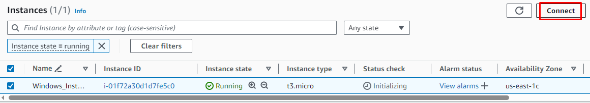
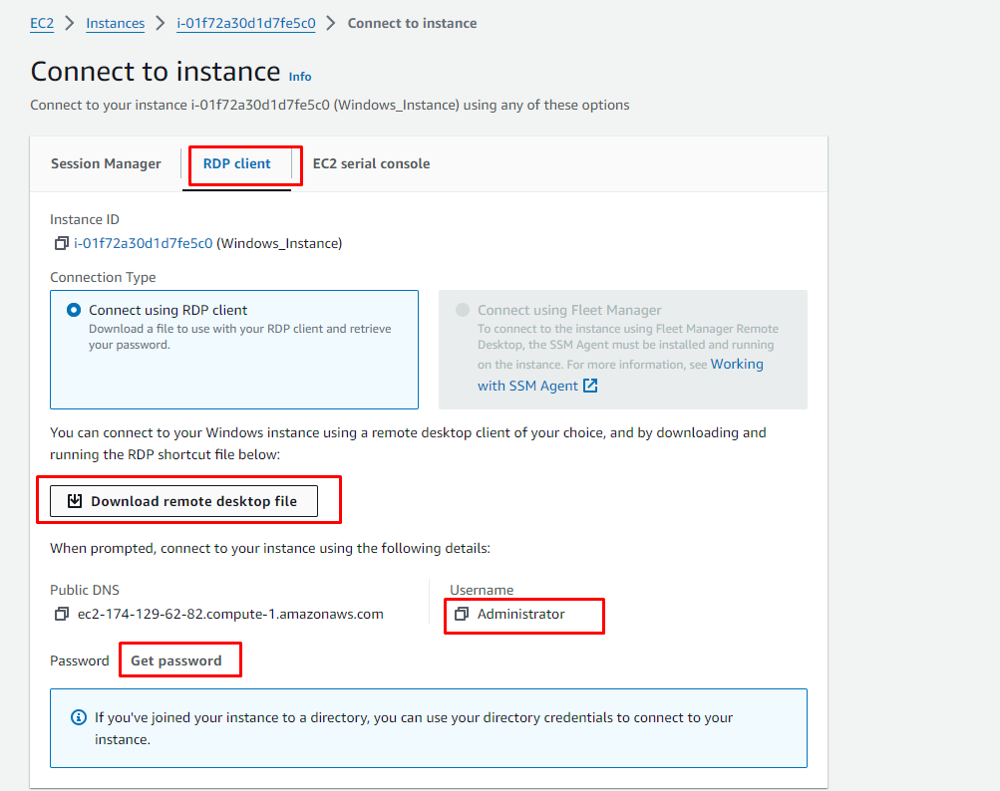
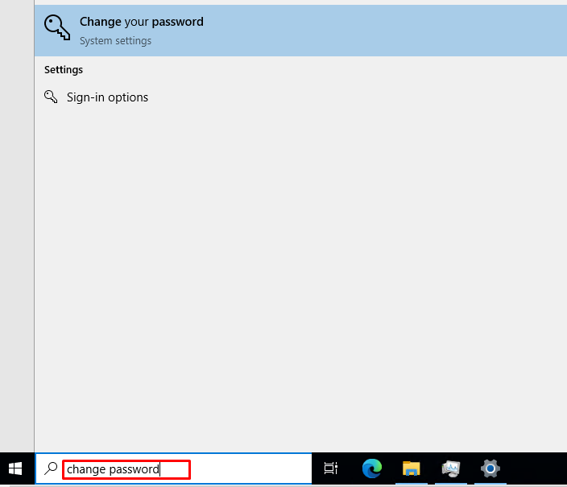

# Project: Create Windows instance on AWS using Terraform

This project help you create and connect to your own Windows instance (VM) on AWS using Terraform

## Overview

### Introduction

- Tech stack: `Terraform`, `AWS`, `Windows server`
- To get basic concepts of these tools, you could visit: [**devops-basic**](https://github.com/tungbq/devops-basic) repository
- Architecture

  

  (The source image provided by AWS at: https://docs.aws.amazon.com/AWSEC2/latest/WindowsGuide/EC2_GetStarted.html)

### Prerequisite

- An AWS account
- AWS CLI installed
- Terraform installed

## 1-Setup

### 1.1-Sign up for an AWS account

- Follow https://docs.aws.amazon.com/AWSEC2/latest/WindowsGuide/get-set-up-for-amazon-ec2.html#sign-up-for-aws

### 1.2-Create a key pair

- Follow https://docs.aws.amazon.com/AWSEC2/latest/WindowsGuide/get-set-up-for-amazon-ec2.html#create-a-key-pair
- Note the key-pair name that you created for later use. E.g: `my-new-keypair-for-demo`
- The private key file is automatically downloaded by your browser. The base file name is the name you specified as the name of your key pair, and the file name extension is determined by the file format you chose. Save the private key file in a safe place.

### 1.3-Install Terraform

- Follow https://github.com/tungbq/devops-basic/tree/main/topics/terraform#installation

### 1.4-Configure Terraform environment to work with AWS

- Check this `Prerequisites` section: https://developer.hashicorp.com/terraform/tutorials/aws-get-started/aws-build#prerequisites

## 2-Launch the new Windows instance

### 2.1-Navigate to the current project

- Ensure you are in the terraform-aws-windows-instance project.
- If not, run `cd terraform-aws-windows-instance`

### 2.2-Update your own credentials/data in `terraform.tfvars`

- Create file `terraform.tfvars`, by running command: `cp terraform.tfvars.sample terraform.tfvars`

#### _Public-IP_

- Then add your public ID here (to allow RDP access from your PC).
  _Tips_: Visit https://www.whatismyip.com/ to get your public IP

#### _Keypair name_

- Provide the keypair name you created in the step `Create a key pair` above

### 2.3-Terraform init

- Run `terraform init`

### 2.4-Terraform plan

- Run `terraform plan`

### 2.5-Terraform apply

- Run `terraform apply`, then check the plan, and type `yes` to confirm!

## 3-Connect to the newly created instance

### 3.1-Get the Public IP

- After running terraform apply, the public IP address of the new instance will be displayed in the Terraform output or you can retrieve it using the AWS Management Console.

### 3.2-Prepare Your Key Pair

- If you used a key pair when creating the instance, ensure that you have the private key file corresponding to the key pair.

### 3.3-Use Remote Desktop Client

- Open the Remote Desktop client on your local machine.

### 3.4-Connect to the Windows Instance

- Enter the public IP address of your instance in the Remote Desktop client.
- If you used a key pair, you might need to provide the private key file during the connection process.

### 3.5-Enter Credentials

#### _Download the RDP connection file and get the Admin password_

- The default password for the Windows instance is generated by AWS and can be retrieved from the AWS Management Console if you didn't provide a specific password during the instance creation.

##### _Go to AWS EC2 console page and select `Connect`_

##### _Then choose `RDP client`_

- Once connected, enter the username and password for the Windows instance.
- The default username for AWS Windows instances is typically `Administrator`.

### 3.6-Access the Windows Desktop

- After successful authentication, you should have access to the Windows desktop of your EC2 instance.
- Then start using it your way, for example open `Microsoft Edge` brower to access Youtube:
  

Congrats! You did it. You now have your own windows VM running on AWS

_Tips:_ Once you are in the Windows, you can change your Windows password to your own definition password for easier access in the next time when needed (Instead of using the very long default password)

## 4-Clean up resource

- If you dont want to use the instance anymore, run `terraform destroy` to terminate your EC2 Windows instance and its related resources
